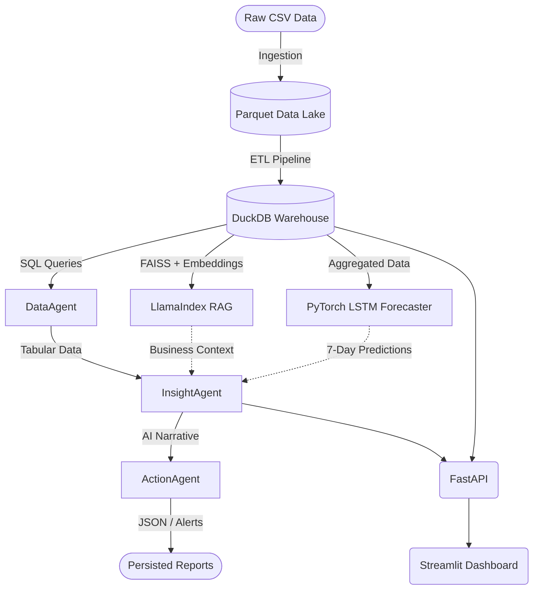

# 🧠 DataMind Codebase Architecture & Walkthrough

This document provides a complete, top-down scan of the entire DataMind project. It explains the purpose of every single directory, file, and technology choice so you can perfectly identify and understand how the code flows from raw data ingestion all the way to autonomous AI actions.

---

## 🏗️ 1. High-Level Architecture Flow

Before diving into the code, here is the lifecycle of your data:

---

## 📂 2. Core Configuration & Setup

### [config/settings.py](file:///c:/Users/Arjeet/Downloads/datamind/datamind/config/settings.py)
This is the heart of your project's configuration. Instead of hardcoding paths or API keys throughout the code, everything is centralized here. 
* It loads secrets from your [.env](file:///c:/Users/Arjeet/Downloads/datamind/datamind/.env) file using `python-dotenv`.
* It defines where the database ([datamind.duckdb](file:///c:/Users/Arjeet/Downloads/datamind/datamind/data/datamind.duckdb) inside [data/](file:///c:/Users/Arjeet/Downloads/datamind/datamind/src/agents/insight_agent.py#115-152)) and machine learning models are saved.
* It sets the default **LLM Provider** (like Oracle Cloud OCI, Ollama, or Cohere) and ML hyper-parameters (like Epochs and Batch size for PyTorch).

### `utils/`
* [oci_llm_service.py](file:///c:/Users/Arjeet/Downloads/datamind/datamind/utils/oci_llm_service.py): Contains a custom [OCILLMService](file:///c:/Users/Arjeet/Downloads/datamind/datamind/utils/oci_llm_service.py#11-75) class. It manages the connection to Oracle Cloud Infrastructure (OCI) using your specific endpoint and authentication to invoke models like `openai.gpt-5.2`.
* [schema.py](file:///c:/Users/Arjeet/Downloads/datamind/datamind/utils/schema.py): Contains lightweight Pydantic schemas (like `LLMRequest`) used to structure inputs to your OCI functions.

---

## 🛢️ 3. The Data Engineering Layer (Ingestion & ETL)
*Data moves from a chaotic CSV into an ultra-fast, structured database.*

### [src/ingestion/data_loader.py](file:///c:/Users/Arjeet/Downloads/datamind/datamind/src/ingestion/data_loader.py)
* **Job:** Turn raw data into a Data Lake.
* **How:** It reads the massive `online_retail_II.csv` using Pandas, drops empty or cancelled orders, and writes extreme-compressed `.parquet` files into `data/parquet/`. This simulates a modern AWS S3-style "Data Lake".

### `src/warehouse/schema.py`
* **Job:** Define the database architecture.
* **How:** Contains standard string SQL commands (DDL) to create a Star Schema in DuckDB. It sets up 4 Dimensions (`dim_date`, `dim_product`, `dim_customer`, `dim_geography`) and 1 Fact table (`fact_sales`), plus an aggregated materialised view for daily operations.

### `src/warehouse/etl.py`
* **Job:** The ETL (Extract, Transform, Load) worker.
* **How:** It takes the Parquet files, assigns surrogate keys (unique integers like `product_key=1`), calculates customer RFM (Recency, Frequency, Monetary) scores, and then rapidly inserts everything into the DuckDB database via SQL commands.

### `src/warehouse/queries.py`
* **Job:** Provide the brainpower for the dashboard.
* **How:** Instead of basic `SELECT *`, this file contains advanced, production-grade SQL with Common Table Expressions (CTEs), Window Functions, and `DATEDIFF` logic to calculate Month-over-Month growth (`monthly_revenue_trend`), cohort retention (`cohort_retention`), and reorder signals.

---

## 🤖 4. The Intelligence Layer (ML & RAG)
*Where math and language models start operating on the structured data.*

### `src/ml/forecaster.py`
* **Job:** Predict future sales.
* **How:** Uses pure **PyTorch** to build an LSTM (Long Short-Term Memory) neural network. It trains on your daily sales data and includes "Monte Carlo Dropout" logic to give you not just a prediction, but a *confidence interval* (the upper and lower bounds of revenue) for the next 7 days.

### `src/rag/indexer.py`
* **Job:** Ground the LLM using Retrieval-Augmented Generation.
* **How:** Uses **LlamaIndex** and HuggingFace vectors (`sentence-transformers`) to build a **FAISS** index of your database tables. It creates an `NL2SQLRouter`—meaning if a user opens the dashboard and types English ("Who bought the most?"), this script vector-searches the schema, converts the English to SQL, executes it against DuckDB, and returns the answer.

---

## 🐙 5. The LangGraph Agent Layer (A2A Orchestration)
*Your multi-agent autonomous workforce.*

### `src/agents/orchestrator.py`
* **Job:** The Manager.
* **How:** It uses **LangGraph** to build an Execution Stategraph (a literal flow chart). It takes an input "intent" (like `reorder_signals`) and routes it identically every time: `DataAgent` ➡️ `InsightAgent` ➡️ `ActionAgent` ➡️ `End`.

### `src/agents/base_agent.py`
* Defines the protocol. Agents don't communicate randomly; they pass heavily structured `A2AMessage` objects to each other to guarantee stability.

### `src/agents/data_agent.py`
* **Job:** The Data Engineer AI.
* **How:** Based on the "intent", it calls the exact advanced SQL function from `src/warehouse/queries.py` and packages the raw numbers (like revenue or falling sales) to send to the next agent.

### `src/agents/insight_agent.py`
* **Job:** The Business Analyst AI.
* **How:** It receives the tabular data, optionally pulls context from the LlamaIndex RAG or the PyTorch forecaster, structures a giant prompt, and sends it to the configured LLM (`oci_llm_service.py` -> OCI GenAI). It tells the LLM to write exactly 3 sentences: Key Finding, Business Implication, and Recommended Action.

### `src/agents/action_agent.py`
* **Job:** The Automation AI.
* **How:** It parses the insight text and determines if an action is required (like warning the user a product stock is down 40%). It securely opens local files using `utf-8` encoding and writes JSON alarms or Executive Markdown Reports directly to the `data/reports/` folder.

---

## 🌐 6. The User Interfaces (Serving)
*How humans actually see and interact with it.*

### `src/api/main.py`
* **Job:** The Backend API.
* **How:** A robust **FastAPI** application. It exposes endpoints (like `GET /warehouse/revenue-trend` or `POST /pipeline/run`) via `uvicorn` on port 8000. This isolates your data processing logic from the front-end, meaning a web app, mobile app, or external system could safely query your data.

### `app/dashboard.py`
* **Job:** The Visual Dashboard.
* **How:** Built entirely in **Streamlit**. It does not calculate data itself; it simply connects to the DuckDB connection, makes API requests, and plots gorgeous charts using **Plotly**. It handles all the tabs ("Revenue Overview", "Demand Forecast"), exposes the buttons to trigger the LangGraph pipeline, and hosts the Natural Language chat interface.
